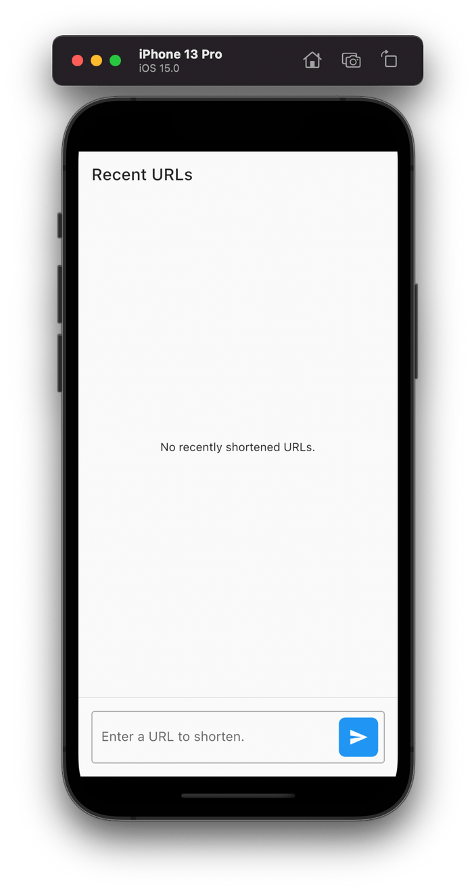
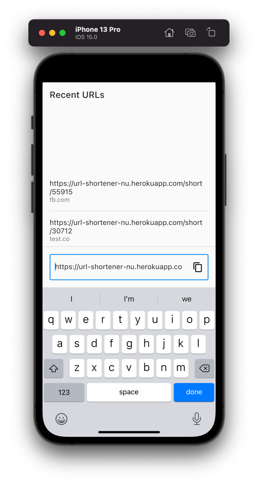

# Link Shortener App

![coverage][coverage_badge]
[![style: very good analysis][very_good_analysis_badge]][very_good_analysis_link]
[![License: MIT][license_badge]][license_link]
[![Commitizen friendly][commitizen_friendly_badge]][commitizen_friendly_link]

A simple link shortener app.

---

## Features

- [x] The user can type the website URL to shorten them using the given [service][link_shortener_url].
- [x] A list with the recently shortened links/aliases.

## Dependencies

- **[Flutter Bloc][flutter_bloc_link]** : State management & built in testing support.
- **[Dio][dio_link]** : Handling network calls.
- **[Freezed][freezed_link]** & **[Json Serializable][json_serializable_link]**: Data classes and Json serialization.
- **[Mocktail](mocktail_link)** : For mocking dependencies.
- **[Very Good Cli](very_good_cli_link)** : Quickly bootstrapping projects with standard practices.

## Architecture & Processes

- Layered architecture with a good separation of concerns between the presentation layer, business logic, repositories & the network layer.
- Tried to follow TDD. Fully tested code. (Widget, Unit & some Integration Tests)
- In par with the [Test Pyramid][test_pyramid_link]

## Improvements

- [ ] Add a feature to fetch a url by it's alias.
- [ ] Add more integration and E2E tests.
- [ ] More fined grained exception handling.
- [ ] Discuss other implementations for showing the recently shortened urls.

---

## Running the project 🚀

**Prerequisite**: Flutter installed on your device. Feel free to consult the [official docs][flutter_install_link].

This project contains 3 flavors:

- development
- staging
- production

To run the desired flavor either use the launch configuration in VSCode/Android Studio or use the following commands:

```sh
# Development
$ flutter run --flavor development --target lib/main_development.dart

# Staging
$ flutter run --flavor staging --target lib/main_staging.dart

# Production
$ flutter run --flavor production --target lib/main_production.dart
```

_\*Link shortener works on iOS, Android, and Web._

---

## Running Tests 🧪

To run all unit and widget tests use the following command:

```sh
$ flutter test --coverage --test-randomize-ordering-seed random
```

To view the generated coverage report you can use [lcov](https://github.com/linux-test-project/lcov).

```sh
# Generate Coverage Report
$ genhtml coverage/lcov.info -o coverage/

# Open Coverage Report
$ open coverage/index.html
```

To run the integration tests, connect to a device and run:

```sh
$ flutter drive --flavor development -t test_driver/link_shortener_app.dart
```

---

## App Screenshots

 

---

Generated by the [Very Good CLI][very_good_cli_link] 🤖

[coverage_badge]: coverage_badge.svg
[commitizen_friendly_badge]: https://img.shields.io/badge/commitizen-friendly-brightgreen.svg
[commitizen_friendly_link]: http://commitizen.github.io/cz-cli/
[dio_link]: https://pub.dev/packages/dio
[empty_recents_image]: images/empty-recents.png
[freezed_link]: https://pub.dev/packages/freezed
[flutter_install_link]: https://docs.flutter.dev/get-started/install
[flutter_bloc_link]: https://pub.dev/publishers/bloclibrary.dev/packages
[json_serializable_link]: https://pub.dev/packages/json_serializable
[license_badge]: https://img.shields.io/badge/license-MIT-blue.svg
[license_link]: https://opensource.org/licenses/MIT
[link_shortener_url]: https://url-shortener-nu.herokuapp.com
[mocktail_link]: https://pub.dev/packages/mocktail
[shortened_urls_image]: images/shortened-urls.png
[test_pyramid_link]: https://martinfowler.com/articles/practical-test-pyramid.html
[very_good_analysis_badge]: https://img.shields.io/badge/style-very_good_analysis-B22C89.svg
[very_good_analysis_link]: https://pub.dev/packages/very_good_analysis
[very_good_cli_link]: https://github.com/VeryGoodOpenSource/very_good_cli
